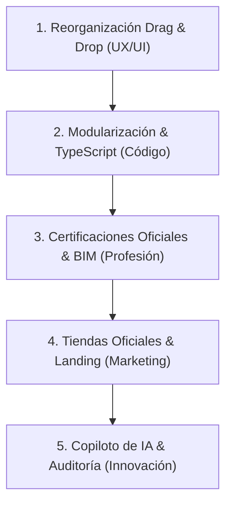

# Plan Estratégico de Mejoras Pendientes — BC3 Viewer

Este documento recoge y detalla las cinco grandes mejoras globales seleccionadas para el futuro desarrollo de **BC3 Viewer**, ordenadas por prioridad de implementación: **4, 1, 3, 2 y 5**.

---

## 📅 Resumen del Roadmap de Implementación

---

## 1. 🖐️ [Medida 4] Reorganización por Drag & Drop en el Árbol del Presupuesto (Prioridad 1)

### Descripción
Permitir a los usuarios reestructurar el presupuesto de forma visual y táctil, arrastrando y soltando (Drag & Drop) capítulos, subcapítulos o partidas directamente en el árbol de visualización de la pantalla principal. Esto incluye poder cambiar el orden relativo de los conceptos o anidarlos/desanidarlos en diferentes niveles.

### Ventajas (Pros)
* **Interactividad Premium:** Convierte el visor en una herramienta de edición activa extremadamente potente y natural.
* **Agilidad en Obra:** Ideal para tablets o dispositivos móviles donde los aparejadores o jefes de obra necesitan reestructurar mediciones rápidamente a pie de obra.
* **Elimina Botones Complejos:** Sustituye o complementa las botoneras direccionales complejas por gestos intuitivos.

### Desafíos / Inconvenientes (Contras)
* **Complejidad del DOM:** El renderizado del árbol jerárquico es complejo y dinámico. Integrar arrastrar y soltar manteniendo la consistencia de los índices jerárquicos FIEBDC-3 requiere algoritmos robustos.
* **Rendimiento:** En presupuestos extremadamente grandes (miles de partidas), el movimiento continuo de nodos en el DOM puede provocar pérdidas de rendimiento si no se optimiza con técnicas de virtualización.

---

## 2. 💻 [Medida 1] Modularización del Código y Migración a TypeScript (Prioridad 2)

### Descripción
Reestructurar la base de código actual (especialmente el archivo monolítico `app.js`) dividiéndolo en módulos lógicos independientes (arquitectura modular) y migrar el proyecto a **TypeScript** para añadir tipado estático fuerte.

### Ventajas (Pros)
* **Alta Mantenibilidad:** Reducción drástica del acoplamiento. Es más fácil añadir características sin peligro de romper módulos adyacentes.
* **Seguridad ante Bugs (Tipado):** TypeScript detecta errores de tipos e inconsistencias en tiempo de compilación (evita errores como referencias temporales nulas o TDZ).
* **Facilidad para Testear:** Habilita la integración de un sistema de pruebas unitarias automáticas (como Vitest o Jest) sobre el parser y los cálculos de certificación.

### Desafíos / Inconvenientes (Contras)
* **Esfuerzo de Refactorización Inicial:** Exige un periodo de trabajo técnico dedicado exclusivamente a reorganizar el código sin añadir nuevas funciones visibles al usuario final.
* **Herramientas de Compilación:** Requiere configurar un empaquetador (como Vite o Webpack) para compilar TypeScript a JavaScript antes del empaquetado nativo con Tauri o Capacitor.

---

## 3. 📐 [Medida 3] Plantillas de Certificación Oficial y Conexión OpenBIM (Prioridad 3)

### Descripción
Orientar el visor a las necesidades reales de facturación del Arquitecto Técnico. Incluye la exportación de actas y certificaciones con formatos oficiales aprobados (plantillas reguladas) y la integración de un motor de visualización 3D ligero (como IFC.js) para asociar las líneas de medición del archivo `.bc3` con los elementos correspondientes del modelo BIM (`.ifc`).

### Ventajas (Pros)
* **Especialización Única:** Convierte la herramienta en una solución profesional indispensable, diferenciándose de visores genéricos.
* **Valor Añadido con BIM:** Visualizar en 3D qué partida se está certificando y verla coloreada en el modelo IFC sitúa el proyecto a la vanguardia de la tecnología ConTech.
* **Automatización del Trabajo:** Ahorra horas de transcripción de datos entre las mediciones de obra y los informes de facturación oficiales.

### Desafíos / Inconvenientes (Contras)
* **Curva de Aprendizaje de IFC.js:** La integración de archivos BIM IFC en el lado del cliente requiere procesar archivos geométricos muy pesados directamente en el navegador.
* **Adaptación a Múltiples Estándares:** Las plantillas de actas de certificación pueden variar ligeramente entre diferentes colegios profesionales o administraciones públicas.

---

## 4. 🚀 [Medida 2] Publicación en Tiendas Oficiales y Landing Page (Prioridad 4)

### Descripción
Crear una página de producto (landing page) moderna y premium dedicada a promocionar la aplicación, y distribuir los instaladores de Windows y Android a través de sus respectivas tiendas oficiales (**Microsoft Store** y **Google Play Store**).

### Ventajas (Pros)
* **Confianza Absoluta:** Descargar la aplicación desde tiendas oficiales elimina las advertencias de seguridad del sistema operativo sobre instaladores desconocidos o APKs sin firmar.
* **Actualizaciones Automáticas:** Los usuarios reciben parches y actualizaciones estables del motor nativo directamente a través del sistema operativo.
* **Posicionamiento SEO/ASO:** Facilita que profesionales que busquen "visor bc3" o "planning de obra" en internet o en las tiendas encuentren la herramienta de forma orgánica.

### Desafíos / Inconvenientes (Contras)
* **Costes de Licencia de Desarrollador:** Google Play exige un pago único y Microsoft Store/Apple Developer requieren suscripciones anuales o registros para publicar.
* **Proceso de Revisión de las Tiendas:** Las directrices de publicación son estrictas y pueden demorar la salida de nuevas versiones debido a los plazos de aprobación.

---

## 5. 🤖 [Medida 5] Copiloto de IA y Auditoría Inteligente (Prioridad 5)

### Descripción
Integrar inteligencia artificial (mediante LLMs ligeros locales o APIs web) para asistir al técnico en la redacción y revisión de su presupuesto. La IA puede generar descripciones de partidas nuevas, detectar precios fuera de mercado (bajas temerarias o errores tipográficos) y autocompletar códigos de bases de datos.

### Ventajas (Pros)
* **Innovación Disruptiva:** Introduce capacidades predictivas avanzadas inexistentes en la mayoría de programas tradicionales de presupuestos.
* **Asistente de Redacción Eficiente:** Redacta pliegos de condiciones y descripciones de partidas en segundos a partir de breves apuntes del técnico.
* **Control de Calidad:** Actúa como un revisor virtual que alerta de incoherencias en las unidades o de partidas críticas olvidadas (ej. elementos de seguridad obligatorios).

### Desafíos / Inconvenientes (Contras)
* **Costes de API y Consumo:** El uso de APIs de IA comerciales (como OpenAI o Gemini) genera costes por consulta que deben ser asumidos.
* **Rendimiento Local:** Utilizar modelos de IA directamente en local dentro del móvil/PC móvil consume recursos elevados de memoria y batería.
